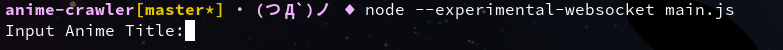
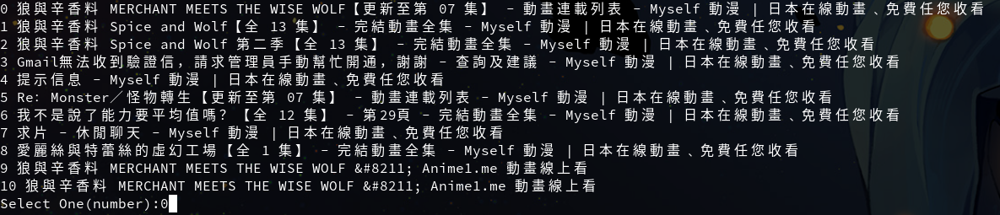
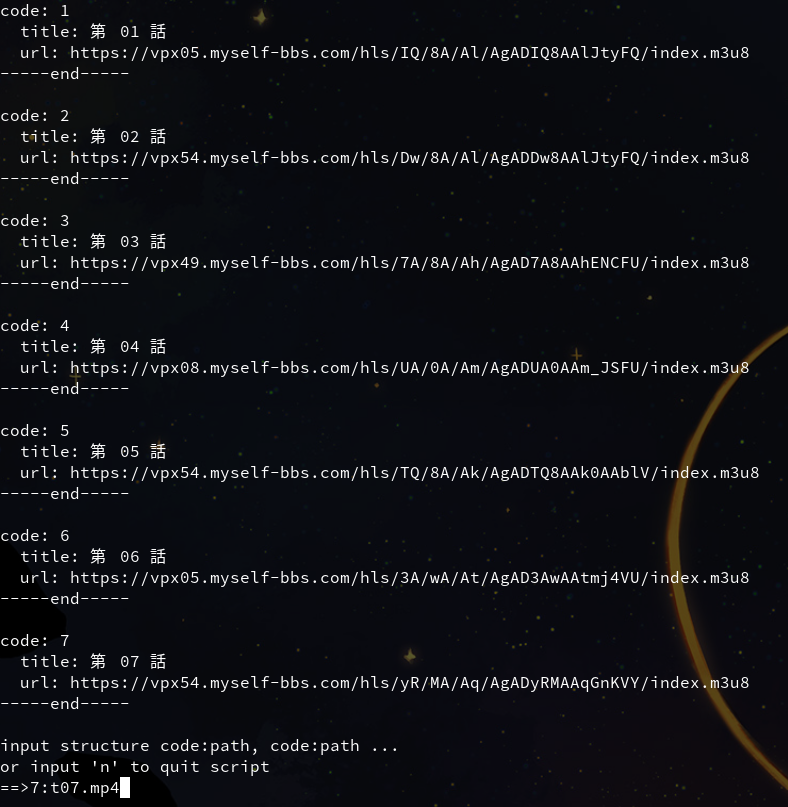

## 安裝
```
git clone https://github.com/stevenhuang226/anime-crawler.git
```
或是下載zip檔案並且解壓縮
## 使用
```
node --experimental-websocket main.js
```

輸入要搜尋的動漫名稱

選擇一個片源

輸入要下載的集數的代碼，冒號，路徑（絕對路徑）並且使用逗號分隔
或是輸入 " n " 取消下載
```
{code}:{path}, {code}:{path}
```
## 依賴
nodejs v20 or later
